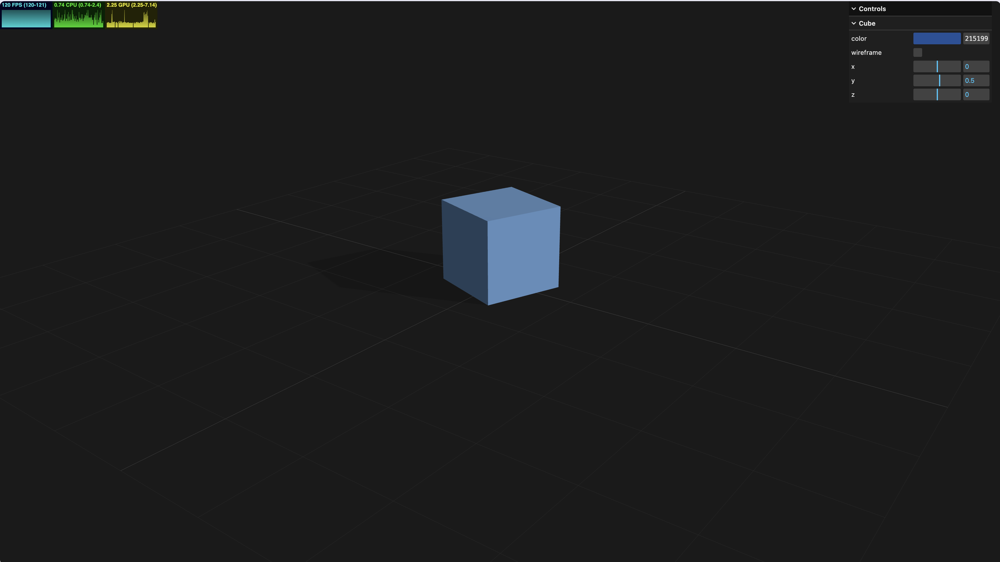

# Three.js TypeScript Boilerplate

Minimal starter for building 3D web experiences with Three.js, TypeScript, and Vite.

<p align="center">
  <a href="https://thibautlfr.github.io/threejs-boilerplate/">
    
  </a>
</p>

<p align="center">
  <a href="https://thibautlfr.github.io/threejs-boilerplate/">Live Demo</a>
</p>

## Features

- **Three.js + TypeScript + Vite** — fast dev server, hot reload, type safety
- **Organized architecture** — singleton Experience pattern, classes self-resolve dependencies via `Experience.getInstance()`
- **Asset loading system** — typed resource loader with progress and ready events
- **Debug UI** — lil-gui panel activated with `#debug` in the URL, toggle with `h` key
- **Performance stats** — FPS/CPU/GPU monitor via stats-gl (visible in debug mode)
- **Grid helper** — ground grid with shadow plane for spatial reference
- **Responsive canvas** — handles resize and pixel ratio changes
- **Proper lifecycle** — every class has a `destroy()` method for clean teardown

## Getting Started

```bash
# Clone the repository
git clone https://github.com/thibautlfr/threejs-boilerplate.git
cd threejs-boilerplate

# Install dependencies
pnpm install

# Start the dev server
pnpm dev
```

Open [http://localhost:5173](http://localhost:5173) to see the scene. Add `#debug` to the URL to open the debug panel.

## Project Structure

```
src/
├── main.ts                      Entry point
├── style.css                    Full-viewport canvas styles
└── experience/
    ├── experience.ts            Singleton root — classes pull deps via getInstance()
    ├── camera.ts                PerspectiveCamera + OrbitControls
    ├── renderer.ts              WebGLRenderer configuration
    ├── sources.ts               Asset source definitions (types + list)
    ├── utils/
    │   ├── debug.ts             lil-gui debug panel
    │   ├── resources.ts         Async asset loader (textures, cube textures, GLTF)
    │   ├── sizes.ts             Window size + pixel ratio tracking
    │   └── time.ts              requestAnimationFrame loop with delta time
    └── world/
        ├── world.ts             Scene setup — lights + objects
        └── cube.ts              Example object with debug UI
```

## How to Use

### Adding a 3D Object

Create a new class in `src/experience/world/` and retrieve what you need from the singleton:

```ts
import * as THREE from "three";
import Experience from "../experience.ts";

export default class MyObject {
    constructor() {
        const experience = Experience.getInstance();

        const geometry = new THREE.SphereGeometry(1, 32, 32);
        const material = new THREE.MeshStandardMaterial({ color: 0x44aa88 });
        const mesh = new THREE.Mesh(geometry, material);
        experience.scene.add(mesh);
    }
}
```

Then instantiate it in `World`'s constructor (inside the `resources.emitter.on("ready", ...)` callback if it depends on loaded assets).

### Loading Assets

Define sources in `src/experience/sources.ts`:

```ts
export const sources: Source[] = [
    {
        name: "myTexture",
        type: "texture",
        path: "/textures/my-texture.jpg",
    },
    {
        name: "myModel",
        type: "gltfModel",
        path: "/models/my-model.glb",
    },
];
```

Access loaded assets via `experience.resources.get("myTexture")` inside the `ready` callback.

### Debug Panel

Activate by navigating to `http://localhost:5173/#debug`, or press `h` to toggle visibility at any time. The debug mode includes the lil-gui panel and a performance monitor (FPS/CPU/GPU).

Use `experience.debug.ui` to add controls:

```ts
const { debug } = Experience.getInstance();

if (debug.active && debug.ui) {
    const folder = debug.ui.addFolder("My Object");
    folder.addColor(material, "color");
    folder.add(mesh.position, "y", -5, 5);
}
```

### Cleanup

Call `window.experience.destroy()` to tear down the entire scene. All geometries, materials, event listeners, and animation frames are properly disposed.

## Scripts

| Command | Description |
|---------|-------------|
| `pnpm dev` | Start development server |
| `pnpm build` | Type-check and build for production |
| `pnpm preview` | Preview the production build locally |
| `pnpm deploy` | Build and deploy to GitHub Pages |

## Deployment (GitHub Pages)

The project is pre-configured for GitHub Pages deployment via `vite.config.ts`.

### How it works

In production, Vite's `base` is automatically set to `/<package-name>/` (read from `package.json`), matching the default GitHub Pages URL pattern `https://<user>.github.io/<repo-name>/`. In development, `base` stays `/` so everything works normally.

Asset paths defined in `sources.ts` are resolved at runtime through `import.meta.env.BASE_URL`, so they work in both environments without any manual prefixing.

### Deploy

```bash
pnpm deploy
```

This runs `pnpm build` automatically before pushing the `dist/` folder to the `gh-pages` branch. Make sure GitHub Pages is configured to serve from the `gh-pages` branch in your repository settings (Settings > Pages > Source > `gh-pages`).

### Custom base path

If the GitHub repository name differs from the `name` field in `package.json`, override the base path with the `VITE_BASE_PATH` environment variable:

```bash
VITE_BASE_PATH=/my-repo-name/ pnpm build
```

## Going Further

This boilerplate is intentionally minimal. Here are common next steps depending on your project:

- **Post-processing** — add `EffectComposer` with bloom, SSAO, or custom shaders via `three/addons`
- **Loading screen** — listen to the `progress` event on `Resources` to build a loading bar overlay
- **GLTF models** — add entries to `sources.ts` and use `resources.get("myModel")` to access loaded models
- **Environment maps** — use `CubeTextureLoader` to load skyboxes or HDRI environments, and set `scene.environment` for PBR materials and/or `scene.background` for a skybox
- **Physics** — integrate [Rapier](https://rapier.rs/) or [Cannon-es](https://pmndrs.github.io/cannon-es/) for rigid body simulation
- **Shaders** — create custom `ShaderMaterial` or `RawShaderMaterial` with GLSL files

## Tech Stack

- [Three.js](https://threejs.org/) — 3D rendering
- [TypeScript](https://www.typescriptlang.org/) — type safety
- [Vite](https://vitejs.dev/) — build tool
- [lil-gui](https://lil-gui.georgealways.com/) — debug UI
- [stats-gl](https://github.com/RenaudRohlworst/stats-gl) — performance monitor
- [Mitt](https://github.com/developit/mitt) — typed event emitter
- [Biome](https://biomejs.dev/) — linting and formatting
